# Árbol de llamadas: `POST /api/v1/dte/firmar_xml`

Endpoint que ejecuta el pipeline completo de emisión DTE: preparación de ítems, paginación, asignación de folios, generación XML y firma digital (TED + SetDTE).

**Ruta:** `POST /api/v1/dte/firmar_xml`  
**Controller:** `Api::V1::DteController#firmar_xml`

---

## Diagrama general

```mermaid
flowchart TD
    A[firmar_xml] --> B[validar_params_preparar]
    A --> C[Empresa.find + certificado_vigente]
    A --> D[preparar_items]
    A --> E[ClasificadorItems.call]
    A --> F[AsignadorFolios.call]
    A --> G[construir_estructura_dte]
    A --> H[GeneradorXml.call]
    A --> I[Firmador.call]
    A --> J[File.write XML firmado]
    A --> K[limpiar_archivos_temporales_antiguos]
    A --> L[ensure: limpiar_archivos_temporales]

    C --> C1[Certificado.completo?]

    D --> D1[Producto.find]
    D --> D2[obtener_impuestos_producto]

    E --> E1[preparar_items]
    E --> E2[generar_pdf / Prawn]

    F --> F1[obtener_tipo_documento]
    F --> F2[obtener_tipo_habilitado]
    F --> F3[asignar_folios_disponibles]

    G --> G1[calcular_totales × página]

    H --> H1[construir_xml]
    H1 --> H2[construir_caratula]
    H1 --> H3[construir_documentos × página]

    I --> I1[insertar_caf × doc]
    I --> I2[firmar_ted × doc]
    I --> I3[firmar_documento × doc]
    I --> I4[firmar_set_dte]
    I --> I5[XmlSignerWithXmlsec.call]

    I5 --> I5a[firmar_con_xmlsec]
    I5 --> I5b[rellenar_firma_setdoc_si_vacia!]
    I5 --> I5c[verificar_con_xmlsec]
    I5 --> I5d[validar_firmas_no_vacias!]
```



---

## Resumen por etapas

| Etapa | Servicio / método | Qué hace |
|-------|-------------------|----------|
| 0 | `validar_params_preparar` | Valida parámetros del request |
| 0 | `Empresa#certificado_vigente` | Verifica certificado antes de empezar |
| 1 | `preparar_items` | Convierte `producto_id` → ítem con precio, neto e impuestos |
| 2 | `ClasificadorItems` | Reparte ítems en páginas según espacio PDF (Prawn) |
| 3 | `AsignadorFolios` | Asigna folio + `rsask` + `rango_folio_id` por página |
| 4 | `construir_estructura_dte` | Arma emisor, receptor y totales por página |
| 5 | `GeneradorXml` | Serializa `EnvioDTE` sin firmar (ISO-8859-1) |
| 6 | `Firmador` | Inserta CAF, firma TED (OpenSSL), inserta templates XMLDSIG |
| 6b | `XmlSignerWithXmlsec` | Completa firmas con `xmlsec1` y verifica |
| post | `limpiar_archivos_temporales*` | Borra temporales; conserva `dte_firmado_*` |

---

## Árbol detallado

```
POST /api/v1/dte/firmar_xml
│
└── Api::V1::DteController#firmar_xml
    │
    ├── [validación]
    │   └── validar_params_preparar
    │
    ├── [BD: empresa + certificado]
    │   ├── Empresa.includes(:acteco_empresas, actecos: []).find_by
    │   ├── empresa.certificado_vigente          → Empresa#certificado_vigente
    │   └── certificado.completo?                → Certificado#completo?
    │
    ├── [etapa 1] preparar_items(params[:items])  ← por cada ítem del request
    │   ├── Producto.includes(:impuestos).find
    │   ├── producto.producto_impuestos.any?
    │   └── obtener_impuestos_producto(producto)
    │       └── producto.impuestos.map
    │           └── impuesto.valor_vigente
    │
    ├── [etapa 2] Dte::ClasificadorItems.call
    │   └── .call → #initialize → #call
    │       ├── resultado_vacio                  (si items vacíos)
    │       ├── preparar_items                   (agrega pagina: nil)
    │       └── generar_pdf
    │           ├── crear_pagina                 (por cada página nueva)
    │           └── Prawn::Document.generate     (simula layout PDF)
    │
    ├── [etapa 3] Dte::AsignadorFolios.call
    │   └── .call → #initialize → #call
    │       ├── resultado_sin_paginas / resultado_tipo_no_encontrado / resultado_no_habilitado
    │       ├── obtener_tipo_documento           → TipoDocumento.find_by
    │       ├── obtener_tipo_habilitado          → TipoHabilitado.find_by
    │       └── asignar_folios_disponibles
    │           ├── RangoFolio.where(...).order('fa ASC')
    │           ├── Folio.where(disponible: true)
    │           └── obtener_ruta_caf(rango)      → rango.rsask
    │
    ├── [etapa 4] construir_estructura_dte
    │   └── paginas.map
    │       └── calcular_totales(items_pagina)   ← por cada página
    │
    ├── empresa.actecos.map                        (actividades económicas)
    │
    ├── [etapa 5] Dte::GeneradorXml.call
    │   └── .call → #initialize → #call
    │       ├── construir_xml
    │       │   ├── construir_caratula
    │       │   │   ├── limpiar_rut
    │       │   │   └── formatear_fecha
    │       │   └── construir_documentos         ← por cada página
    │       │       └── construir_documento
    │       │           ├── generar_id_documento
    │       │           ├── construir_encabezado
    │       │           │   ├── construir_id_doc
    │       │           │   ├── construir_emisor     → limpiar_rut, escape_xml, truncar
    │       │           │   ├── construir_receptor   → limpiar_rut, escape_xml, truncar
    │       │           │   └── construir_totales
    │       │           ├── construir_detalles       ← por cada ítem
    │       │           │   └── construir_codigo_item
    │       │           └── construir_timbre_electronico → limpiar_rut, escape_xml, truncar
    │       └── File.write                         (tmp/dte_*.xml)
    │
    ├── [etapa 6] Dte::Firmador.call
    │   └── .call → #initialize → #call
    │       ├── Empresa.find → certificado_vigente → completo?
    │       ├── Nokogiri::XML(@xml_string)
    │       │
    │       ├── [por cada página / documento]
    │       │   ├── insertar_caf
    │       │   │   ├── RangoFolio.find
    │       │   │   └── rango.archivo_rango_folio.download
    │       │   ├── firmar_ted
    │       │   │   ├── OpenSSL::PKey::RSA.new(rsask)
    │       │   │   ├── dd_node.canonicalize
    │       │   │   ├── priv_key.sign (SHA1)
    │       │   │   └── quitar_saltos_linea
    │       │   └── firmar_documento
    │       │       ├── doc_node.canonicalize
    │       │       ├── calcular_digest
    │       │       └── insertar_signature_como_hijo
    │       │           └── construir_signature_xml
    │       │
    │       ├── firmar_set_dte
    │       │   ├── set_dte_node.canonicalize
    │       │   ├── calcular_digest
    │       │   └── insertar_signature_template_after
    │       │       └── construir_signature_xml
    │       │
    │       └── Dte::XmlSignerWithXmlsec.call
    │           └── .call → #initialize → #call
    │               ├── validar_credenciales!
    │               │   ├── certificado.completo?
    │               │   ├── contenido_key          → archivo_key.download
    │               │   └── contenido_cert         → archivo_crs.download
    │               ├── escribir_credenciales
    │               ├── firmar_con_xmlsec          → ejecutar → Open3 (CLI xmlsec1 --sign)
    │               ├── rellenar_firma_setdoc_si_vacia!
    │               │   └── int_to_be_bytes
    │               ├── verificar_con_xmlsec       → ejecutar → Open3 (CLI xmlsec1 --verify)
    │               └── validar_firmas_no_vacias!
    │
    ├── File.write                                 (tmp/dte_firmado_*.xml) ← se conserva
    ├── limpiar_archivos_temporales_antiguos(60)
    ├── render json
    │
    └── ensure
        └── limpiar_archivos_temporales(@archivos_temporales)
            └── File.delete                          (PDF + XML intermedio)
```

---

## Archivos involucrados

| Archivo | Clase / método principal |
|---------|--------------------------|
| `app/controllers/api/v1/dte_controller.rb` | `DteController#firmar_xml` y métodos privados |
| `app/services/dte/clasificador_items.rb` | `Dte::ClasificadorItems` |
| `app/services/dte/asignador_folios.rb` | `Dte::AsignadorFolios` |
| `app/services/dte/generador_xml.rb` | `Dte::GeneradorXml` |
| `app/services/dte/firmador.rb` | `Dte::Firmador` |
| `app/services/dte/xml_signer_with_xmlsec.rb` | `Dte::XmlSignerWithXmlsec` |
| `app/models/empresa.rb` | `Empresa#certificado_vigente` |
| `app/models/certificado.rb` | `Certificado#completo?` |

---

## Notas importantes

### Dos tipos de firma

- **TED (`firmar_ted`)**: firmado con la clave privada del CAF (`rsask`) vía OpenSSL.
- **Documento y SetDTE**: templates XMLDSIG insertados por `Firmador`; el `SignatureValue` real lo completa `xmlsec1` en `XmlSignerWithXmlsec`.

### Certificado leído varias veces

El certificado de la empresa se valida en el controller y se vuelve a obtener dentro de `Firmador` y `XmlSignerWithXmlsec`.

### Método no usado en este flujo

`Firmador#leer_archivo_caf` existe pero **no se invoca** desde `firmar_xml`. `insertar_caf` lee el CAF directamente con `rango.archivo_rango_folio.download`.

### Archivos temporales

| Archivo | ¿Se elimina? |
|---------|--------------|
| `tmp/dte_firma_*.pdf` | Sí (en `ensure`) |
| `tmp/dte_*.xml` (intermedio) | Sí (en `ensure`) |
| `tmp/dte_firmado_*.xml` | **No** — se conserva como referencia |

### Dependencias externas

- **Prawn**: simulación de layout PDF en `ClasificadorItems`.
- **OpenSSL**: firma del TED en `Firmador`.
- **xmlsec1** (CLI): firma y verificación XMLDSIG en `XmlSignerWithXmlsec`.
- **Nokogiri**: parseo y manipulación XML en `GeneradorXml`, `Firmador` y `XmlSignerWithXmlsec`.

---

## Fases de error reportadas en la respuesta JSON

| Campo `fase` | Cuándo ocurre |
|--------------|---------------|
| `verificacion_certificado` | Empresa sin certificado vigente o incompleto |
| `asignacion_folios` | No hay folios CAF suficientes |
| `generacion_xml` | Fallo en `GeneradorXml` |
| `firma_digital` | Fallo en `Firmador` o `XmlSignerWithXmlsec` |
